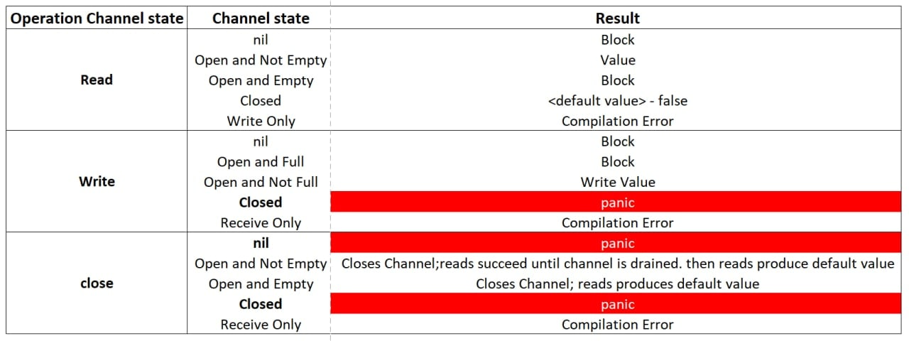

Что выведет программа? Объяснить вывод программы.
```
package main

func main() {
	ch := make(chan int)
	go func() {
		for i := 0; i < 10; i++ {
			ch <- i
		}
	}()

	for n := range ch {
		println(n)
	}
}
```
Ответ:
```

Бесконечное чтение канала - deadlock
```